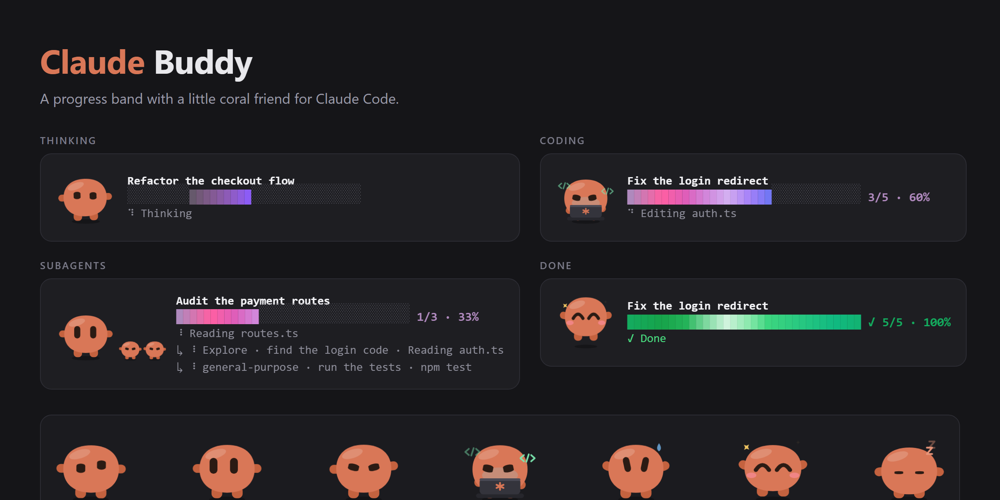

# Claude Buddy

A progress band for [Claude Code](https://claude.com/claude-code) with a little coral friend. It sits above the prompt and shows what Claude is working on, how far along it is, and what it is doing right now.



*The faces are the plugin's own SVG. The bar is drawn as text cells, as it is in the app.*

## Install

```sh
claude plugin marketplace add karrot0/claude-buddy
claude plugin install progress-buddy@progress-buddy
```

Start a new session and send a prompt. Features, the moods, how it works, and exactly what the plugin does with your session are in the [plugin README](plugins/progress-buddy/README.md).

## Repository layout

| Path | What it is |
| --- | --- |
| `plugins/progress-buddy/` | The plugin itself: hooks, the SVG buddy, icon, README, license. |
| `.claude-plugin/marketplace.json` | Makes this repository a plugin marketplace. |
| `dev/tests/` | The plugin's test suite. Kept outside the plugin folder. |
| `docs/demo.png` | The preview image above. |

## Development

```sh
claude plugin validate plugins/progress-buddy
claude plugin validate .claude-plugin/marketplace.json

# run the tests: copy them in, run, remove
cp -r dev/tests plugins/progress-buddy/tests
claude plugin test plugins/progress-buddy
rm -r plugins/progress-buddy/tests
```

## License

[MIT](LICENSE). Claude Buddy is an unofficial community project and is not affiliated with or endorsed by Anthropic.
